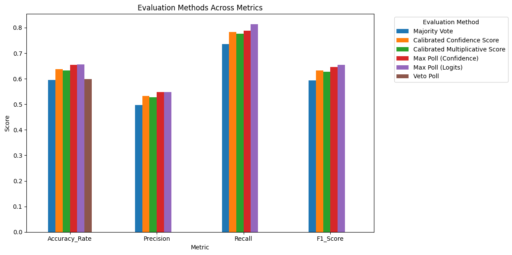
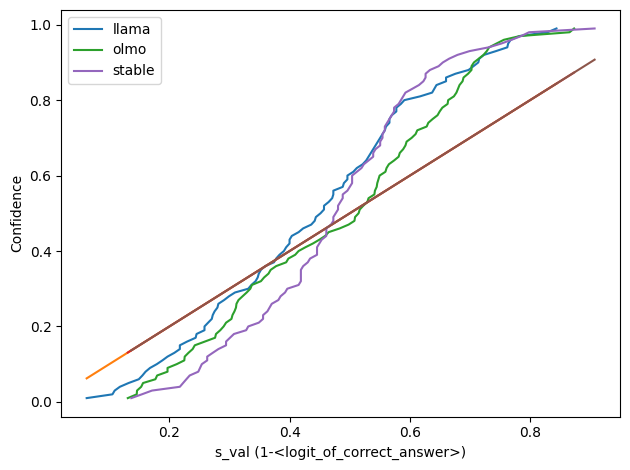

Citations
Replacing Judges with Juries: Evaluating LLM Generations with a Panel of Diverse Models: https://arxiv.org/abs/2404.18796

Conformal Prediction with Large Language Models for Multi-Choice Question Answering: https://arxiv.org/abs/2305.18404

Conformal Language Modelling: https://arxiv.org/abs/2306.10193

Some of the code is derived from: https://github.com/Varal7/conformal-language-modeling?tab=readme-ov-file https://github.com/Varal7/clm_aux

Purpose:

This project is inspired by the Panel of Juries paper by Cohere. The Panel of Juries paper uses three LLM's to determine the accuracy of the output of a base model given a reference answer. 
For example, given a question such as "What is the capital of France?", the base model might output "Paris". The original question and its output is sent to a panel of 3 LLM's, each of which 
determines if the given answer to the question is correct or incorrect.
However, when determining the final judgement of the juries, their methodology simply uses a majority vote (ie, if 2 of out 3 juries say the answer is correct, than the answer is deemed correct)
rather than exploring other adjudication processes based on the confidence of each jury. If one jury is more certain of its response than another jury, it does not make sense to consider the 
votes of both of those juries as equal. This project explores and measures various adjudication methods that take into account the confidence of each jury. 
This can be used for model evaluation, exam grading, LLM reasoning, etc.

Other notable differences between this project and the Panel of Juries:

1) Juries in this project are finetuned to output either "True" or "False". The original paper uses a few shot prompt rather than finetuning. Using a few-shot prompt collapses the output space such that the logits
   of "True" and "False" repeat themselves across each sample (eg, you might see softmax logits of [0.62, 0.38] for True and False respectively across many samples). This appears to be because
   the few shot pre-prompt dominates the question/answer pair such that variations in the question/answer pair only change the logits to one of a finite set of possibilities that are effectively
   determined by the pre-prompt. This is a problem because if we want to judge the confidence of the jury LLM's using logits, we shouldn't have the confidence be influenced by the pre-prompt. This is why the
   juries in this project are being finetuned and given a zero-shot prompt so that we can more accurately measure the confidence of each jury.
2) The juries in the panel of juries paper are given a reference answer against which the base model's answer is judged. This project does not provide a reference answer and expects the juries to use their own
   internal knowledge to judge the answer.

Measuring Confidence:

The calibrated confidence is measured using a method derived from the paper "Conformal Prediction with Large Language Models for Multi-Choice Question Answering". That paper uses conformal prediction to provide
a subset of answers from multiple choices while providing a probabilistic gaurantee that one of those given answers is correct. This project adapts that methodology to provide the highest confidence with which
the model can return one answer from a set of two (ie, "True" or "False"). This confidence is then used in some of the adjudication processes given below.

Adjudication processes:

This project considers the following adjudication processes as alternatives to majority voting:
1) Max polling (logits): Takes the answer of the jury that is most certain of it's judgement as determined by the highest logits (eg, if jury A says "True" with logit of 0.8 for "True" and jury B says "False" with
   logit of 0.6 for "False", then jury A takes precedence because it has a higher logit for the judgement it gave).
2) Max polling (confidence): Same as above except it uses the calibrated confidence of the juries.
3) Calibrated confidence score: Sum the calibrated confidence scores for the juries that said "True" and the juries that said "False".
4) Calibrated multiplicative score: Given the confidence of each jury, calculate the probability that the juries saying "False" are independantly wrong and the probability that the juries saying "True" are
   independently wrong. The one that is least likely to occur is considered the correct judgement.
5) Veto poll: If any of the juries say that the answer is incorrect, it is considered incorrect.

The following data for each of the adjudication processes has been created by:
1) Calibration and test data is filtered to only include data on which one of the jury models disagree's with the other two.
2) Calibration and test sets are then shuffled between each other given a random seed.
3) Results of the test data are aggregated for each seed.
4) The data on which the models were finetuned are allowed to be imbalanced.

Given seeds 0 to 9 inclusive, the results for each adjudication process is:

Calibrated confidence score, calibrated multiplicative score, max poll (confidence), and max poll (logits) all give more accurate results than majority vote. Note: Veto poll has 0 precision, recall, and F1 because for data on which there are disagreements between the jury models, the veto method always considers the answer to be false and it's about as accurate as majority vote.

Conclusion:
The results suggest that Majority Voting is a suboptimal adjudication process and that other adjudication processes may provide higher accuracy.

Further exploration:
In theory, "Max Poll (Confidence)" should give better results than "Max Poll (Logits)" because the calibrated confidence takes into account the miscalibration of the logits for each model. However, max polling on the confidence only does about as well as max polling on the logits. This needs further investigation and experimentation with different calibration methodologies (eg, calibrating on derived subsets of the data). The following graph shows significant miscalibration between the logits and the confidence

