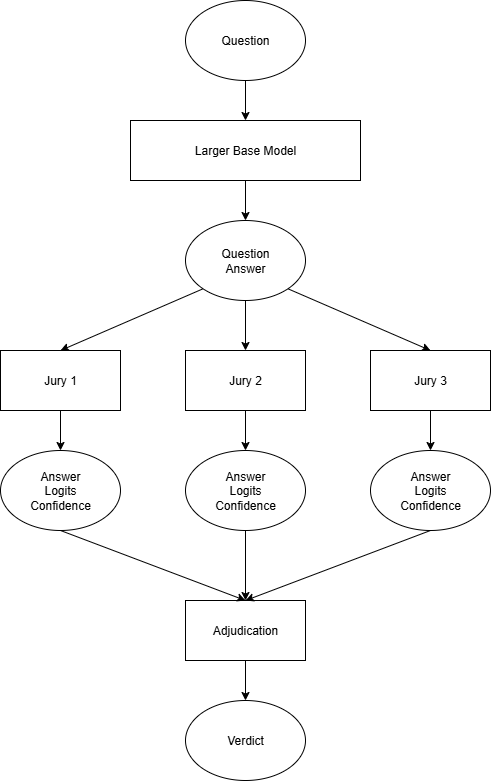

# Problem
The lack of reliability of LLM's is a significant issue holding back their utility. Models might hallucinate as a consequence of intra-model bias or random chance. This is especially costly in situations that require a high degree of accuracy or in reasoning models where one error on any reasoning step can throw off the whole chain of reasoning. Having a model self verify it's own answers can reduce hallucinations that occur by random chance but this does not account for intra-model biases introduced in the model's training or data collection. Furthermore, there should be a way to quantify the confidence of the model's answer in order to reduce the chances of an hallucination to an acceptable level. 

# Solution
This project uses 3 smaller fine-tuned models (called "juries") to judge the veracity of the answers given by a larger model on Triviaqa questions. It uses Conformal Prediction to quantify each jury model's certainty in it's judgement of the base model and evaluates various adjudication processes to come up with a final verdict for the answer of the base model. This project also demonstrates the benefits of uncertainty quantification in evaluating model outputs. The following diagram displays the architecture of the system.

Once the base model generates an answer to a given trivia question, the question/answer pair is sent to each jury to determine the veracity of the answer. Each of the jury models generates it's own judgement (True or False) and softmax logits for the tokens True/False and corresponding calibrated confidence score.

# Demo Video
https://www.loom.com/share/9857a01614114523956722cace173f0f?sid=abd877de-0e72-4ffe-b148-570830bed06d

# Uncertainty Quantification
A key element to this project is uncertainty quantification using logits and conformal prediction. Quantifying the uncertainty of the juries can make the adjudication and the final verdict more accurate because it allows the adjudication process to consider the confidence of the judgement by each jury model. In this project, there are two ways that we quantify the uncertainty of the juries: through softmax logits of "True"/"False" tokens and the calibrated confidence.

The softmax logits of True and False relative to each other represents the model's estimate of how confident it is that the given answer to the question is accurate or inaccurate. For example, if a jury gives logits of 0.8 and 0.2 for True and False respectively, that represents a higher level of certainty than if the same model were to give logits of 0.6 and 0.4. 

Also, if we are comparing the certainty of one jury to another jury, we need a way to convert the logits of each model to a quantification of it's certainty because logits of 0.8/0.2 for one jury may represent a different level of certainty than logits of 0.8/0.2 for another jury. For example, when jury 1 gives logits of 0.8/0.2, it may be right 75% of the time while jury 2 may be right 85% of the time when it gives logits of 0.8/0.2. This is where Conformal Prediction can be used to provide a quantification of uncertainty.

# Conformal Prediction
Conformal Prediction is a statistical framework in machine learning that allows models to provide reliable confidence measures for their predictions. Unlike traditional models that output a single prediction, conformal predictors generate prediction sets or intervals that are guaranteed (under certain assumptions) to contain the true value with a specified probability. In this project, the juries can only output "True" or "False", in the prediction (judgement) sets. However, for any specified probability and question/answer pairing, conformal prediction methods may return a set of two answers (True and False) rather than one because it may be the case that the jury is not certain enough in either possible answer for the conformal prediction methodology to return a single judgement (True or False) with enough confidence. In this project, we determine a jury's confidence in its judgement as the highest confidence with which it can return a set of one answer ("True" or "False"). 

# Calibration Method for Predicting Confidence
The problem of judging an answer as either "True" or "False" can be considered a 2-class classification problem with "True" and "False" being the two classes. Let us define M as the softmax logits of tokens "True" and "False" with respect to each other (as opposed to the entire vocabulary). This means that the sum of M always adds up to 1. The label for each input will be either [1,0] (True) or [0,1] (False). Let us define S to be the difference between the correct class in the label and the corresponding class in M. For example, if the label is [1,0] and M is [0.85, 0.15], S is 0.15 (result of 1 - 0.85). Conversely, if the label is [1,0] and M is [0.2, 0.8], S is 0.8 (result of 1 - 0.2). 

Conformal prediction for a classification task will generate a set of answers while providing a probabilistic gaurantee that the set contains a correct answer. When producing such a set, let St represent the size of the range of S values that would be admissable into such a set. For example, if we choose St of 0.6, then all classes with S values below 0.6 will be included in the set. If we choose St of 0.3, then all classes with S value below 0.3 will be included. Given a small subset of the data which we will call the calibration set, for each St value we determine the percentage of the data points for which that St value will cover the correct class. 

Example 1: Given a label of [1,0], M of [0.85, 0.15] an St value of 0.2 would cover the correct class which has an S of 0.15 (1 - 0.85). However, an St of 0.1 would not cover it.  
Example 2: Given a label of [0,1], M of [0.6, 0.4] an St value of 0.5 would not cover the correct class which has an S of 0.6 (1 - 0.4) but it would include the incorrect class which has an S 0.4 (1 - 0.6). It should be noted that an St of 0.65, in this case, would cover both classes and produce a set which has both "True" and "False".

The error rate, e, for a given St is the percent of data points in the calibration set for which the St does not cover the correct class. We can use this method to map various St values to corresponding e values.

# Test and Inference Time

During test/inference time, we don't want to produce answer sets with more than one potential answer so we assume that the true class is the one with the highest logits and return the lowest error rate, e (highest St), for which we get a set of one answer. The value of 1-e then becomes the confidence reported for that answer.

Example: Given M of [0.9, 0.1], the S value of the second highest logit would be 0.9 (1 - 0.1). We retrieve the corresponding e value for the largest St value that is less than 0.9 (Determined during calibration). Suppose the e for St=0.9 is 0.05. Then 0.95 becomes the confidence associated with having a set of one answer because it is the highest confidence with which it can retrieve a set of one answer. 

# Adjudication processes

This project considers the following adjudication processes:
1) Majority Voting: Polls the 3 jury model and returns the most common verdict between them.
2) Max polling (logits): Takes the answer of the jury that is most certain of it's judgement as determined by the highest logits (eg, if jury A says "True" with logit of 0.8 for "True" and jury B says "False" with
   logit of 0.6 for "False", then jury A takes precedence because it has a higher logit for the judgement it gave).
3) Max polling (confidence): Same as above except it uses the calibrated confidence of the juries.
4) Calibrated confidence score: Sum the calibrated confidence scores for the juries that said "True" and the juries that said "False".
5) Calibrated multiplicative score: Given the confidence of each jury, calculate the probability that the juries saying "False" are independantly wrong and the probability that the juries saying "True" are
   independently wrong. The one that is least likely to occur is considered the correct judgement.
6) Veto poll: If any of the juries say that the answer is incorrect, it is considered incorrect.

The following data for each of the adjudication processes has been created by:
1) Calibration and test data is filtered to only include data on which one of the jury models disagree's with the other two.
2) Calibration and test sets are then shuffled between each other given a random seed.
3) Results of the test data are aggregated for each seed.
4) The data on which the models were finetuned are allowed to be imbalanced.

Given seeds 0 to 9 inclusive, the results for each adjudication process is:

Calibrated confidence score, calibrated multiplicative score, max poll (confidence), and max poll (logits) all give more accurate results than majority vote. Note: Veto poll has 0 precision, recall, and F1 because for data on which there are disagreements between the jury models, the veto method always considers the answer to be false and it's about as accurate as majority vote.

# Conclusion
The results suggest that Majority Voting is a suboptimal adjudication process and that other adjudication processes may provide higher accuracy.

# Further exploration
In theory, "Max Poll (Confidence)" should give better results than "Max Poll (Logits)" because the calibrated confidence takes into account the miscalibration of the logits for each model. However, max polling on the confidence only does about as well as max polling on the logits. This needs further investigation and experimentation with different calibration methodologies (eg, calibrating on derived subsets of the data). The following graph shows significant miscalibration between the logits and the confidence

# Instructions

The following are the commands used to run the code on Google Colab. This includes everything from generating the data from the base model, finetuning the jury models, getting jury responses, calibrating for confidence scores, and test results.

### Importing To Colab
!git clone --branch master https://github.com/Flaagrah/JuriesDemo.git

import os

os.environ["TORCHINDUCTOR_DISABLE_CUDA_GRAPH"] = "1"

os.environ["TORCHINDUCTOR_DISABLE"] = "1"  # disables TorchInductor entirely

os.environ["TORCH_COMPILE_DISABLE"] = "1"  # disables torch.compile() backend

os.environ["HF_TOKEN"] = <Hugging Face Token>

### Importing Libraries

!pip install accelerate cohere transformers datasets bitsandbytes --quiet

!pip install --upgrade datasets huggingface_hub fsspec

### Change Working Directory

%cd JuriesDemo

All following commands assume that the root of the project is working directory.

### Generate Base Model Data

!python create_data_sets.py CohereLabs/c4ai-command-r-v01 <Hugging Face Token>

This command creates the answers to the question in the triviaqa dataset along with the correctness of the answer which is then used as a label to fine tune and test the juries.

### Fine Tune Jury Models

!python fine_tune_jury.py stabilityai/StableBeluga-13B stable13b <Hugging Face Token>

!python fine_tune_jury.py allenai/OLMo-2-1124-13B olmo13b <Hugging Face Token>

!python fine_tune_jury.py openlm-research/open_llama_13b open_llama_13b <Hugging Face Token>

These commands fine tune the jury models.

### Run Jury Models

!python run_jury_models.py qlora_stable13b_finetuned/checkpoint-313 stable13b <Hugging Face Token>

!python run_jury_models.py qlora_olmo13b_finetuned/checkpoint-313 olmo13b <Hugging Face Token>

!python run_jury_models.py qlora_open_llama_13b_finetuned/checkpoint-313 llama13b <Hugging Face Token>

These commands generate the response of the juries to the question/answer pairs from the data generated from the base model.

# Citations
### Replacing Judges with Juries: Evaluating LLM Generations with a Panel of Diverse Models
https://arxiv.org/abs/2404.18796

### Conformal Prediction with Large Language Models for Multi-Choice Question Answering
https://arxiv.org/abs/2305.18404

### Conformal Language Modelling
https://arxiv.org/abs/2306.10193

#### Some of the code is derived from
https://github.com/Varal7/conformal-language-modeling?tab=readme-ov-file

https://github.com/Varal7/clm_aux

### Generate Experimental Results

!python main.py

This script generates the data need to analyze the various adjudication processes.
